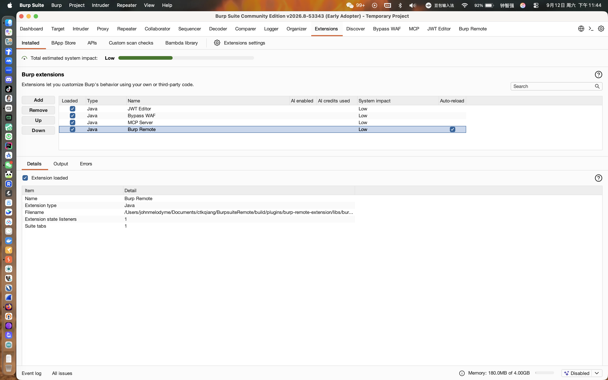
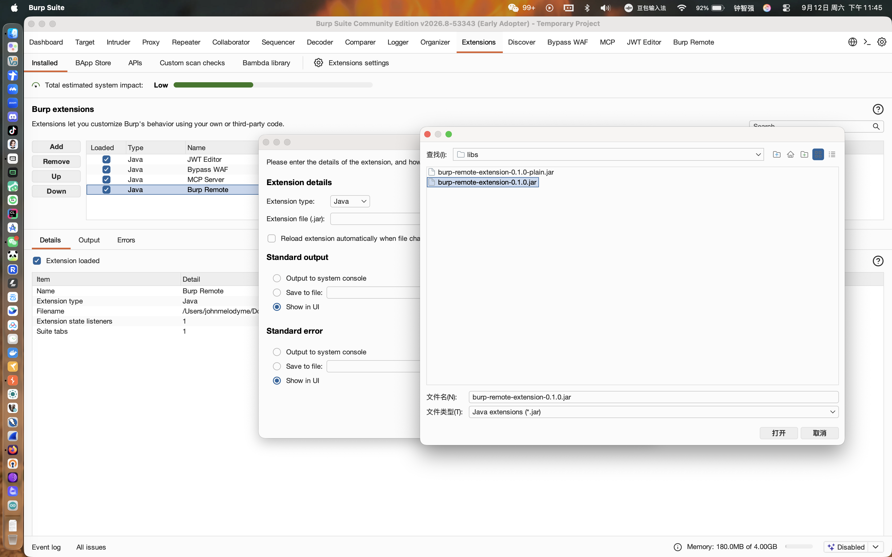
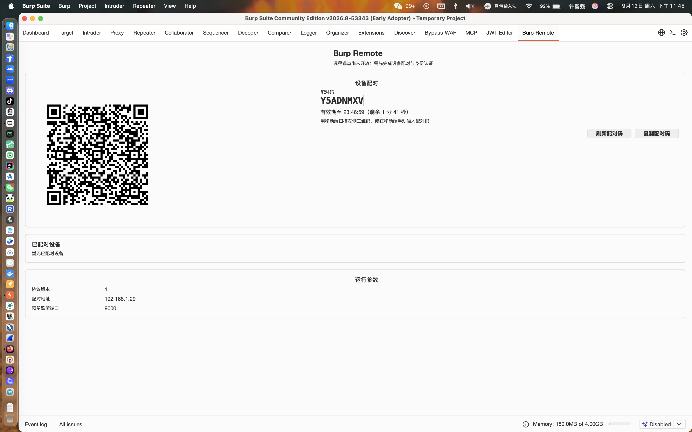
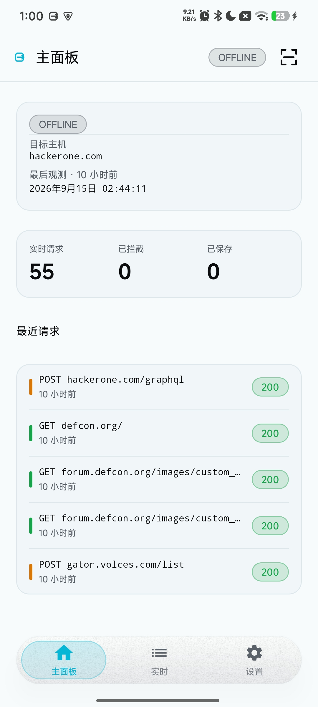
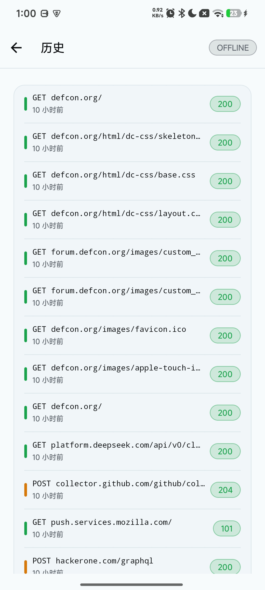
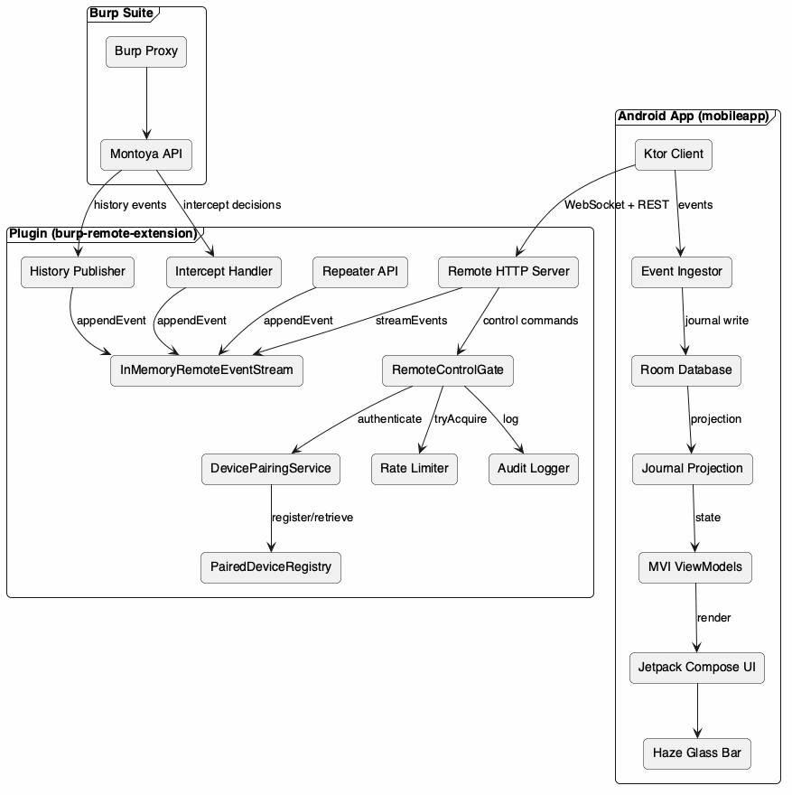
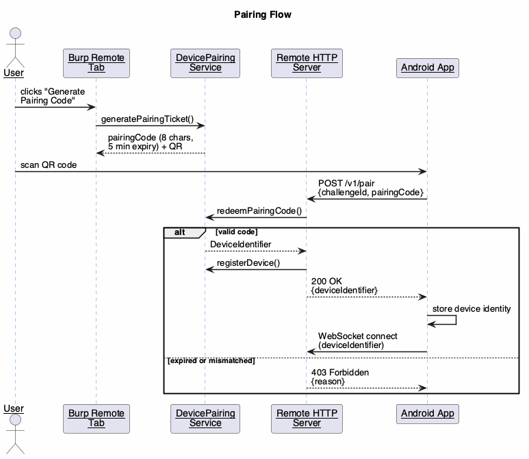
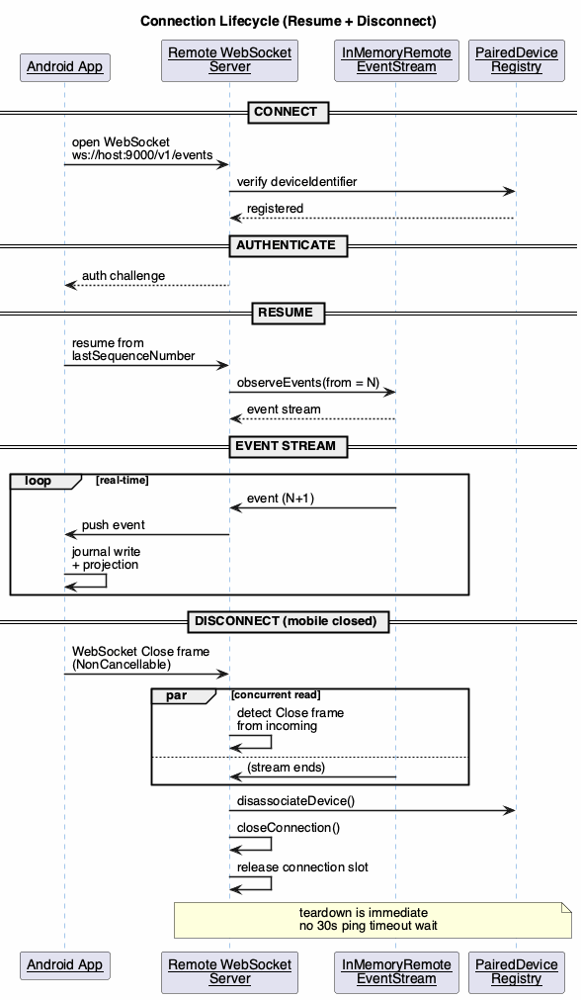
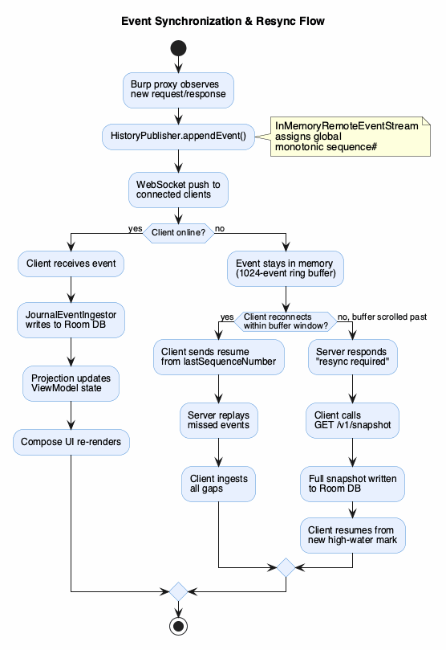

# Burp Remote

[](https://kotlinlang.org) [](https://developer.android.com) [](https://portswigger.net/burp) [](https://github.com/ctkqiang/BurpsuiteRemote/releases) [](LICENSE) []() [](https://www.ctkqiang.xin/BurpSuiteRemote/) [](https://github.com/ctkqiang/BurpsuiteRemote/commits/main) [](https://github.com/ctkqiang/BurpsuiteRemote/pulls)

**Red Team Remote Control Framework | 红队远程控制平台**

_A Burp Suite extension + Android app that streams proxy history, intercept decisions, and repeater entries to your phone in real time_

**Burp Remote** is two pieces: an extension running inside Burp Suite (the engine) and an Android
client (the remote). Burp does all the computation; the phone only sends commands and renders
results — proxy history reaches your phone in milliseconds, intercepted requests can be forwarded,
dropped or edited-and-forwarded with one tap, and Repeater entries can be executed and reviewed at
any time.

Built for web and mobile penetration testing, bug bounty hunting and CTF work where you keep the
proxy running for hours and would rather not stay tied to your desk. The extension and client talk
only to each other over your local network — no third-party service involved.

[中文](README.md)

**Docs site** · [online](https://www.ctkqiang.xin/BurpSuiteRemote/) · or just open `docs/index.html` in a browser — zero dependencies, no build step

<table cellspacing="16">
  <tr>
    <td align="center"><br/><b>Extension loaded</b></td>
    <td align="center"><br/><b>Selecting the JAR</b></td>
    <td align="center"><br/><b>Pairing screen</b></td>
  </tr>
  <tr>
    <td align="center"><br/><b>Mobile dashboard</b></td>
    <td align="center"><br/><b>Connection screen</b></td>
    <td></td>
  </tr>
</table>

---

## Contents

- [Legal Notice](#legal-notice)
- [Positioning](#positioning)
- [Core Features](#core-features)
- [Quick Start](#quick-start)
  - [Requirements](#requirements)
  - [Build the extension JAR](#build-the-extension-jar)
  - [Build the Android APK](#build-the-android-apk)
  - [Pairing](#pairing)
- [REST API Reference](#rest-api-reference)
- [Technical Architecture](#technical-architecture)
- [Security Design](#security-design)
- [Theme System](#theme-system)
- [Developer Guide](#developer-guide)
- [Real-world Scenarios](#real-world-scenarios)
- [FAQ](#faq)
- [Contributing](#contributing)
- [Security Policy](#security-policy)
- [License](#license)
- [Support](#support)

---

## Legal Notice

> **This tool is intended solely for security researchers conducting authorized security assessments, red-blue exercises, and CTF competitions.** **Scanning/attacking/intercepting systems without authorization is illegal; users bear full legal responsibility.** **The developer is not responsible for any unlawful use under any circumstances.**

---

## Positioning

Burp Remote is a Burp Suite remote-control framework for red teamers and security researchers. It brings Burp's proxy history, intercept queue, and Repeater workflows onto your Android phone, so you can keep the engagement moving without sitting in front of the machine.

```
Burp proxy → event sourcing → WebSocket push → mobile projection → Compose render
```

### How it differs

| Capability | Burp Remote | Remote desktop (RDP/VNC) | Desktop Burp |
|------------|-------------|--------------------------|--------------|
| Native mobile experience | Yes | No (laggy zoom) | No |
| Real-time history push | Yes | manual refresh | Yes |
| Intercept forward/drop | Yes (one tap) | awkward | Yes |
| Remote Repeater execution | Yes | awkward | Yes |
| Offline browsing of synced data | Yes | No | No |
| Home screen widget | Yes | No | No |
| 8 themes + liquid glass | Yes | No | No |
| 5-language localization | Yes | partial | No |

---

## Core Features

### Real-time Proxy History

- WebSocket event stream delivers history entries to your phone in milliseconds
- Each record carries method, URL, status code, timestamp
- Tap through to full request + response bodies

### Remote Intercept Decisions

- Intercepted requests pop up on your phone
- One-tap Forward / Drop / Modify-and-forward
- Decisions are sent back to Burp for actual execution

### Remote Repeater Execution

- Send history entries to Repeater in one tap
- View and edit request bodies on the phone
- Results (status code, duration, response body) sync both ways

### Home Screen Widget

- Shows target host, live request count, intercept count, saved count
- Tap to jump back to the dashboard
- Reads from SharedPreferences — no persistent background service

### 8 Themes + Liquid Glass

- 3 light/dark modes (follow system / light / dark) × 8 flavors, orthogonal
- Bottom nav bar uses Haze real-time blur + highlight gradient + inner shadow + elevation
- Light and dark parameters tuned separately (see "Theme System" below)

---

## Quick Start

### Requirements

- JDK 17 (Burp 2025.x runs on 17; higher bytecode is rejected at load)
- Burp Suite Community or Professional (2025.x or later)
- Android device API 26 (Android 8.0) or above
- Both on the same LAN (extension listens on `0.0.0.0:9000` by default)

### Build the extension JAR

```bash
scripts/build-burp-extension.sh
# Output: build/plugins/burp-remote-extension/libs/burp-remote-extension-0.1.0.jar
```

Load in Burp:**Extensions → Installed → Add → Java → select the JAR**.

### Build the Android APK

```bash
scripts/build-mobile-app.sh
# Output: build/mobileapp/app/outputs/apk/debug/app-debug.apk
adb install -r build/mobileapp/app/outputs/apk/debug/app-debug.apk
```

Both scripts accept `JAVA_HOME_FOR_BUILD` to point at JDK 17 and pass extra args through to Gradle.

### Pairing

1. Load the extension JAR — it listens on `0.0.0.0:9000`
2. Open the "Burp Remote" tab in Burp to see the QR code + pairing code
3. Install the APK, scan the QR or enter the code manually
4. Connected — events start syncing

The pairing code is 8 characters, valid for 5 minutes, using a confusable-free alphabet (no I/O/0/1/L/U). Scan once and the device identity is registered; reconnect doesn't require re-scanning.

---

## REST API Reference

The extension exposes REST endpoints at `http://<your-IP>:9000`; the WebSocket event stream is at `ws://<your-IP>:9000/v1/events`.

### Endpoints

| Method | Path | Purpose |
|--------|------|---------|
| GET | `/v1/status` | Runtime status (protocol version, port, paired devices) |
| POST | `/v1/pair` | Submit pairing code, obtain device identity |
| GET | `/v1/capabilities` | Server capability declaration |
| GET | `/v1/snapshot` | Full snapshot (fallback when resync fails) |
| GET | `/v1/history` | Proxy history list |
| GET | `/v1/history/{id}` | Single history item (request + response body) |
| POST | `/v1/scope/{id}` | Send history item to Repeater |
| GET | `/v1/intercepts` | Intercept queue |
| GET | `/v1/intercepts/{id}` | Single intercept detail |
| POST | `/v1/intercepts/{id}/forward` | Forward |
| POST | `/v1/intercepts/{id}/drop` | Drop |
| POST | `/v1/intercepts/{id}/modify` | Modify and forward |
| POST | `/v1/repeater` | Create repeater entry |
| GET | `/v1/repeaters` | Repeater list |
| GET | `/v1/repeaters/{id}` | Single repeater detail |
| POST | `/v1/repeaters/{id}/execute` | Execute repeater request |

### Event Types

| Event type | Source | Meaning |
|-----------|--------|---------|
| `history.item.observed` | Proxy history publisher | History added/updated |
| `intercept.created` | Intercept proxy handler | New request intercepted |
| `intercept.forwarded` | Intercept proxy handler | Request forwarded |
| `intercept.dropped` | Intercept proxy handler | Request dropped |
| `repeater.created` | REST API | Repeater entry created |
| `repeater.execution.started` | REST API | Execution started |
| `repeater.execution.completed` | REST API | Execution finished |

Each event carries a globally monotonic sequence number used for resumption.

### WebSocket Handshake

Fixed handshake order:

```
CONNECT → AUTHENTICATE → RESUME → event stream
```

Connections are capped; over-limit connections get `TRY_AGAIN_LATER`.

---

## Technical Architecture

### Event Sourcing

The extension uses an event-sourced model: proxy observations, intercept decisions, and repeater actions are stamped with a monotonically increasing sequence number and pushed over WebSocket. Sequence numbers are allocated centrally by `InMemoryRemoteEventStream` — history, intercept, and repeater publishers share one `AtomicLong`. Previously, independent counters caused collisions that silently dropped events at the mobile sync coordinator.

The stream keeps the most recent 1024 events in a ring buffer. Brief disconnects resume from the last sequence number; if the buffer has scrolled past, the server asks the client to fetch a `/v1/snapshot` and resume.

### Connection Lifecycle

Disconnection is symmetric: the mobile app sends a WebSocket Close frame (wrapped in `NonCancellable` to ensure delivery), and the plugin concurrently reads `incoming` frames to detect it immediately — tearing down the session, releasing the connection slot, and disassociating the device, without waiting for the 30-second ping timeout.

### Directory Structure

```
BurpSuiteRemote/
├── plugins/burp-remote-extension/      # Burp extension (Kotlin, JDK 17)
│   ├── src/main/                       # production code
│   │   ├── adapter/                    # history/intercept/repeater adapters
│   │   ├── transport/                  # HTTP server, WS server, event stream, rate limiter
│   │   ├── security/                   # pairing service, device registry
│   │   └── protocol/                   # protocol contract (port, message types)
│   ├── src/test/                       # unit tests
│   └── src/harness/                    # end-to-end harness (no Burp dependency)
├── client/mobileapp/                   # Android app (Compose, MVI)
│   ├── app/                            # entry, navigation, DI, widget
│   ├── data/                           # repo impls, Room, Ktor client
│   ├── domain/                         # use cases, entities, settings, connection state
│   ├── ui/                             # theme (8 flavors × 2 modes), design system
│   ├── core/                           # shared model / protocol / common
│   └── feature/                        # 9 feature modules
│       ├── connection/                 # QR pairing
│       ├── dashboard/                  # home panel
│       ├── history/                    # proxy history
│       ├── intercept/                  # intercept queue
│       ├── repeater/                   # repeater
│       ├── settings/                   # theme & config
│       ├── sharing/                    # share
│       ├── screenshot/                 # screenshot
│       └── archive/                    # archive
├── scripts/                            # build scripts (JDK 17 required)
├── .github/                            # release workflow + bilingual issue templates
└── docs/                               # screenshots + PlantUML diagrams
```

### Diagrams

<table cellspacing="16">
  <tr>
    <td align="center"><br/><b>Architecture Overview</b></td>
    <td align="center"><br/><b>Pairing Flow</b></td>
  </tr>
  <tr>
    <td align="center"><br/><b>Connection Lifecycle</b></td>
    <td align="center"><br/><b>Event Synchronization</b></td>
  </tr>
</table>

---

## Security Design

| Measure | Implementation |
|---------|---------------|
| Device pairing | One-time code, 5-minute expiry, confusable-free alphabet (no I/O/0/1/L/U) |
| Authentication | Every connection carries a `DeviceIdentifier`; unregistered devices are rejected |
| Rate limiting | Per-device token bucket: burst 20, steady-state 5/sec |
| Idempotency | Operation ID dedup; retries return the original result instead of re-executing |
| Audit logging | Every command logs device, type, operation ID, result |
| LAN-only | Plain HTTP (no TLS); not meant for public internet exposure |

---

## Theme System

Light/dark mode and flavor are orthogonal: mode controls base luminance, flavor controls accent and tone.

Three modes: follow system / light / dark.

| Flavor | Accent | Personality |
|--------|--------|-------------|
| Burp Classic | Orange `#FF6633` | Brand default |
| Cyber Cyan | Cyan `#22D3EE` | Cold cyberpunk |
| Forest Emerald | Emerald `#34D399` | Natural, grounded |
| Royal Violet | Violet `#A78BFA` | Elegant, mysterious |
| Rose Gold | Rose `#FB7185` | Warm, soft |
| Ocean Blue | Blue `#60A5FA` | Calm, clear |
| Solar Amber | Amber `#FBBF24` | Sunset warm |
| Monochrome | None | Most restrained |

Semantic colors (success=green, warning=yellow, error=red, info=blue) are consistent across flavors; syntax highlighting is unified too.

Bottom nav bar liquid glass: Haze real-time blur + translucent surface + top highlight gradient + bottom inner shadow + elevation, tuned separately for light and dark.

---

## Developer Guide

### Tech Stack

**Extension**: Kotlin, Ktor 3.1.3 (CIO server + WebSocket + content negotiation), kotlinx.serialization 1.8.1, ZXing (QR codes), Montoya Burp API. Built with Gradle + Shadow for fat JAR; quality gates via ktlint + detekt.

**Android app**: Kotlin 2.2.0, Jetpack Compose (BOM 2025.11.00), Haze 1.5.3 (liquid glass), Room 2.8.4, Ktor 3.1.3 client, DataStore 1.1.7, CameraX 1.6.2 + MLKit 17.3.0 (scanning), MVI unidirectional data flow. minSdk 26 / targetSdk 36.

### Build & Test

```bash
# extension (with quality gates)
scripts/build-burp-extension.sh

# mobile app
scripts/build-mobile-app.sh
```

### Release

Push a tag to trigger GitHub Actions:

```bash
git tag v0.1.0
git push origin v0.1.0
```

CI builds the JAR (with gates) and APK using JDK 17, attaching both to a GitHub Release.

---

## Real-world Scenarios

### Scenario 1: Away-from-desk intercept decisions

Burp proxies traffic on your laptop; you step away and an intercept fires — your phone buzzes, you tap "Forward", Burp resumes.

### Scenario 2: Rechecking Repeater on the train

You tuned a Repeater request earlier; on the train, pull out your phone to check the latest execution result (status, duration, response body).

### Scenario 3: Offline history browsing

With the network down, you can still browse already-synced history; reconnect and it auto-resumes.

---

## FAQ

**Q: Can't connect?** A: Confirm both are on the same LAN, the extension listens on `0.0.0.0:9000`, and the firewall allows port 9000.

**Q: Pairing code expired?** A: Codes expire after 5 minutes — regenerate.

**Q: History items not syncing to Repeater?** A: Make sure you're on a build with the sequence-number collision fix; older builds with three independent counters silently drop events.

**Q: IPv6 support?** A: IPv4 by default; `0.0.0.0` on the LAN covers typical use.

---

**If this tool helped you, please give it a star!**

**Red team arsenal, defending the nation**

---

## Contributing

Issues and pull requests are welcome. Two files to read before you start:

- [`.trae/rules.md`](.trae/rules.md) — the repository's binding rules: naming, comments, event
  sourcing and layering. Where it conflicts with personal preference, it wins.
- [`.trae/plan.md`](.trae/plan.md) — module responsibilities and design intent.

Conventions:

| Item | Requirement |
|------|-------------|
| Toolchain | JDK 17. Burp 2025.x rejects higher bytecode, so an extension built with any other JDK fails to load |
| Static checks | `ktlint` + `detekt` are wired into the build: formatting is a build gate, not a review comment. Run `./gradlew ktlintCheck detekt` locally first |
| Commit messages | Conventional Commits; scopes limited to `plugins` / `client` / `protocol` / `docs` / `build` |
| Commit granularity | One logical change per commit; never mix formatting churn with behaviour changes |
| Dependencies | Check `libs.versions.toml` for something reusable before adding a new one |
| Never commit | Build output, keystores, `keystore.properties` or any local configuration |

Please use the existing issue templates ([bug](.github/ISSUE_TEMPLATE/bug_report.md) ·
[feature](.github/ISSUE_TEMPLATE/feature_request.md) ·
[question](.github/ISSUE_TEMPLATE/question.md)) and include both the extension and mobile versions.

---

## Security Policy

This tool remotely controls Burp Suite, and it assumes **the local network is trustworthy**:

- Transport is plain HTTP with no TLS, and it is deliberately **not meant to be exposed to the
  public internet**. Do not port-forward 9000, and do not use it on untrusted networks.
- Pairing codes are single-use and expire after 5 minutes; every connection carries a device
  identity and unregistered devices are rejected; control commands are rate-limited and
  deduplicated by operation ID.
- Archived originals stay byte-exact; redaction applies to exported copies only.

To report a security issue, please **do not open a public issue**. Email
`johnmelodymel@qq.com`, or use Security → Report a vulnerability on GitHub. Include reproduction
steps and impact.

---

## License

MIT — see [LICENSE](LICENSE) for the full text. Free to use, modify and redistribute, including
commercially, provided the copyright and permission notice are retained.

This project is for **authorised** security testing only. Scanning, attacking or intercepting
systems without authorisation is illegal and the user bears full legal responsibility — see the
[Legal Notice](#legal-notice) at the top.

---

<div align="center">

<h2>Support</h2>

<p>If this project helps you, Star / Fork are welcome — or buy me a coffee</p>
<p><sub>Your support keeps it maintained and improving</sub></p>

<br/>

<strong>Scan to donate via WeChat</strong><br/><br/>


<br/>
<br/>

</div>

---

Built with Kotlin · Compose liquid glass UI · event-sourced design · ctkqiang
