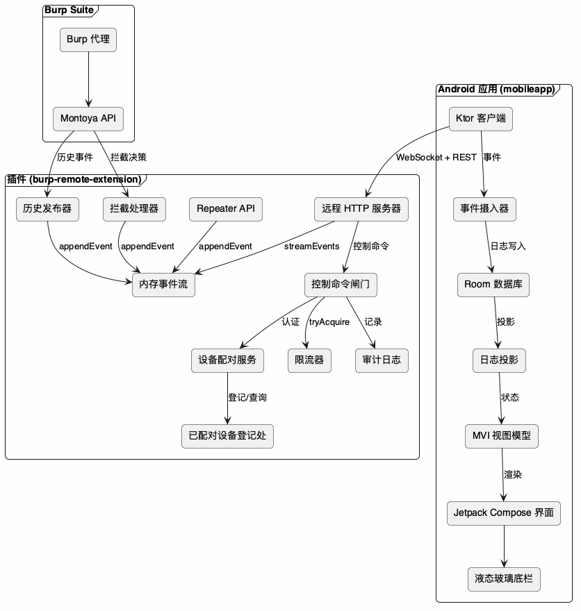
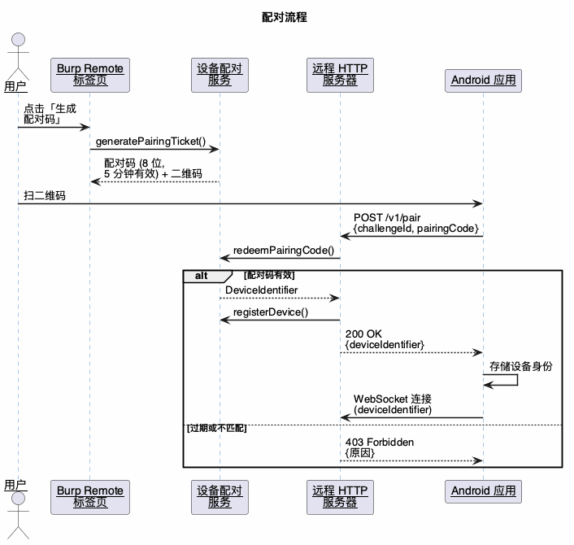
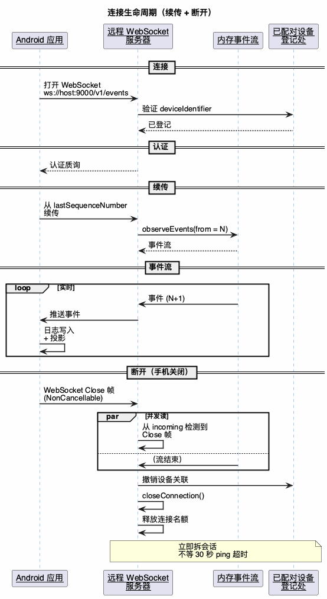
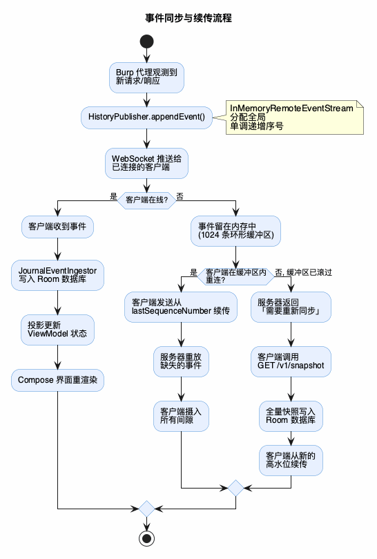

# Burp Remote

[](https://kotlinlang.org) [](https://developer.android.com) [](https://portswigger.net/burp) [](https://github.com/ctkqiang/BurpsuiteRemote/releases) [](LICENSE) []() [](https://www.ctkqiang.xin/BurpsuiteRemote/) [](https://github.com/ctkqiang/BurpsuiteRemote/commits/main) [](https://github.com/ctkqiang/BurpsuiteRemote/pulls)

**红队远程控制平台 | Red Team Remote Control Framework**

_一个 Burp Suite 扩展 + Android 应用，把代理历史、拦截决策、Repeater 条目实时搬到你的手机屏幕_

[English](README.en.md)

**文档站** · [在线版](https://www.ctkqiang.xin/BurpsuiteRemote/) · 或直接用浏览器打开 `docs/index.html`（零依赖、零构建）

<table cellspacing="16">
  <tr>
    <td align="center"><br/><b>扩展已加载</b></td>
    <td align="center"><br/><b>选择 JAR 加载</b></td>
    <td align="center"><br/><b>配对二维码界面</b></td>
  </tr>
  <tr>
    <td align="center"><br/><b>手机端主面板</b></td>
    <td align="center"><br/><b>手机端连接界面</b></td>
    <td></td>
  </tr>
</table>

---

## 目录

- [法律声明](#法律声明)
- [项目定位](#项目定位)
- [核心功能](#核心功能)
- [快速开始](#快速开始)
  - [环境要求](#环境要求)
  - [构建插件 JAR](#构建插件-jar)
  - [构建 Android APK](#构建-android-apk)
  - [配对](#配对)
- [REST API 详解](#rest-api-详解)
- [技术架构](#技术架构)
- [安全设计](#安全设计)
- [主题系统](#主题系统)
- [开发指南](#开发指南)
- [实战场景](#实战场景)
- [常见问题](#常见问题)
- [贡献](#贡献)
- [安全策略](#安全策略)
- [许可证](#许可证)
- [支持](#支持)

---

## 法律声明

> **本工具仅供安全研究人员在获得书面授权的情况下进行安全评估、红蓝对抗、CTF 竞赛使用。** **未经授权对他人系统进行扫描/攻击/拦截测试属违法行为，使用者需自行承担一切法律责任。** **开发者在任何情况下不对使用者的违法行为负责。**

---

## 项目定位

Burp Remote 是一款面向红队/安全研究人员的 Burp Suite 远程扩展。它把 Burp 的代理历史、拦截队列、Repeater 三条工作流完整搬到 Android 手机上，让你不用坐在电脑前也能推进测试进度。

```
Burp 代理 → 事件溯源 → WebSocket 推送 → 手机端投影 → Compose 渲染
```

### 与其他方案的区别

| 能力 | Burp Remote | 远程桌面 (RDP/VNC) | 桌面 Burp |
|------|------------|-------------------|----------|
| 原生手机体验 | 是 | 否（缩放卡顿） | 否 |
| 代理历史实时推送 | 是 | 需手动刷新 | 是 |
| 拦截放行/丢弃 | 是（一键） | 操作困难 | 是 |
| Repeater 远程执行 | 是 | 操作困难 | 是 |
| 离线浏览已同步数据 | 是 | 否 | 否 |
| 桌面小部件 | 是 | 否 | 否 |
| 8 套主题 + 液态玻璃 | 是 | 否 | 否 |
| 多语言（5 种） | 是 | 部分 | 否 |

---

## 核心功能

### 代理历史实时推送

- WebSocket 事件流，历史条目毫秒级到达手机
- 每条记录含方法、URL、状态码、时间戳
- 点进详情看完整请求体 + 响应体

### 拦截队列远程决策

- Burp 拦截到的请求弹到手机上
- 一键放行（Forward）/ 丢弃（Drop）/ 修改后放行
- 决策回传 Burp 实际执行

### Repeater 远程执行

- 历史条目一键发到 Repeater
- 手机端查看、编辑请求体
- 执行结果（状态码、耗时、响应体）双向同步

### 桌面小部件

- 显示目标主机、实时请求数、拦截数、保存数
- 点一下跳回主面板
- 从 SharedPreferences 读快照，不依赖后台服务常驻

### 8 套主题 + 液态玻璃

- 明暗 3 档（跟随系统/浅色/深色）× 8 套口味，正交组合
- 底部导航栏用 Haze 实时模糊 + 高光渐变 + 内阴影 + 浮起投影
- 深浅色分别调参，见下文「主题系统」

---

## 快速开始

### 环境要求

- JDK 17（Burp 2025.x 跑在 17，更高字节码加载被拒）
- Burp Suite 社区版或专业版（2025.x 及以上）
- Android 手机 API 26（Android 8.0）及以上
- 电脑与手机同一局域网（扩展默认监听 `0.0.0.0:9000`）

### 构建插件 JAR

```bash
scripts/build-burp-extension.sh
# 产物：build/plugins/burp-remote-extension/libs/burp-remote-extension-0.1.0.jar
```

在 Burp 加载：**Extensions → Installed → Add → Java → 选这个 JAR**。

### 构建 Android APK

```bash
scripts/build-mobile-app.sh
# 产物：build/mobileapp/app/outputs/apk/debug/app-debug.apk
adb install -r build/mobileapp/app/outputs/apk/debug/app-debug.apk
```

两个脚本都接受 `JAVA_HOME_FOR_BUILD` 指定 JDK 17，附加参数透传 Gradle。

### 配对

1. 加载插件 JAR，它监听 `0.0.0.0:9000`
2. 打开 Burp 的 "Burp Remote" 标签页，看到二维码 + 配对码
3. 手机装 APK，扫码或手动输配对码
4. 连接成功，事件开始同步

配对码 8 位、5 分钟有效、去混淆字符集（无 I/O/0/1/L/U）。扫一次即登记设备身份，重连不用再扫。

---

## REST API 详解

扩展在 `http://<你的IP>:9000` 暴露一组 REST 端点，WebSocket 事件流在 `ws://<你的IP>:9000/v1/events`。

### 端点一览

| 方法 | 路径 | 用途 |
|------|------|------|
| GET | `/v1/status` | 运行状态（协议版本、端口、已配对设备） |
| POST | `/v1/pair` | 提交配对码，换取设备身份 |
| GET | `/v1/capabilities` | 服务端能力声明 |
| GET | `/v1/snapshot` | 全量快照（续传失败时兜底） |
| GET | `/v1/history` | 代理历史列表 |
| GET | `/v1/history/{id}` | 单条历史（请求体 + 响应体） |
| POST | `/v1/scope/{id}` | 历史条目发到 Repeater |
| GET | `/v1/intercepts` | 拦截队列 |
| GET | `/v1/intercepts/{id}` | 单条拦截详情 |
| POST | `/v1/intercepts/{id}/forward` | 放行 |
| POST | `/v1/intercepts/{id}/drop` | 丢弃 |
| POST | `/v1/intercepts/{id}/modify` | 修改并放行 |
| POST | `/v1/repeater` | 创建 Repeater 条目 |
| GET | `/v1/repeaters` | Repeater 列表 |
| GET | `/v1/repeaters/{id}` | 单条 Repeater 详情 |
| POST | `/v1/repeaters/{id}/execute` | 执行 Repeater 请求 |

### 事件类型

| 事件类型 | 来源 | 含义 |
|---------|------|------|
| `history.item.observed` | 代理历史发布器 | 历史新增/更新 |
| `intercept.created` | 拦截代理处理器 | 拦截到新请求 |
| `intercept.forwarded` | 拦截代理处理器 | 请求被放行 |
| `intercept.dropped` | 拦截代理处理器 | 请求被丢弃 |
| `repeater.created` | REST API | 新建 Repeater 条目 |
| `repeater.execution.started` | REST API | 执行开始 |
| `repeater.execution.completed` | REST API | 执行完成 |

每条事件带全局单调递增序号，供手机端断点续传。

### WebSocket 握手

握手顺序固定：

```
CONNECT → AUTHENTICATE → RESUME → 事件流
```

连接数有上限，超限回 `TRY_AGAIN_LATER`。

---

## 技术架构

### 事件溯源

扩展采用事件溯源模型：代理观测、拦截决策、Repeater 操作都打上单调递增序号，经 WebSocket 推给客户端。序号由 `InMemoryRemoteEventStream` 集中分配——历史、拦截、Repeater 三个发布者共用一把 `AtomicLong`。此前各自维护计数器会撞号，导致事件在手机端同步协调器被判重复投递而静默丢弃。

事件流在内存保留最近 1024 条（环形缓冲）。短暂掉线直接按序号续传；掉线过久缓冲滚过，服务端要求客户端取 `/v1/snapshot` 全量快照再续传。

### 连接生命周期

断开是对称的：手机端发 WebSocket Close 帧（包 `NonCancellable` 确保发出），插件端并发读 `incoming` 帧即时感知，立刻拆会话、释放连接名额、撤销设备关联——不等 30 秒 ping 超时。

### 目录结构

```
BurpsuiteRemote/
├── plugins/burp-remote-extension/      # Burp 扩展（Kotlin，JDK 17）
│   ├── src/main/                       # 生产代码
│   │   ├── adapter/                    # 历史/拦截/Repeater 适配器
│   │   ├── transport/                  # HTTP 服务器、WS 服务器、事件流、限流
│   │   ├── security/                   # 配对服务、设备登记处
│   │   └── protocol/                   # 协议契约（端口、消息类型）
│   ├── src/test/                       # 单元测试
│   └── src/harness/                    # 端到端夹具（不依赖 Burp）
├── client/mobileapp/                   # Android 应用（Compose，MVI）
│   ├── app/                            # 入口、导航、DI、小部件
│   ├── data/                           # 仓储实现、Room、Ktor 客户端
│   ├── domain/                         # 用例、实体、设置、连接状态
│   ├── ui/                             # 主题（8 口味 × 2 明暗）、设计系统
│   ├── core/                           # 共享 model / protocol / common
│   └── feature/                        # 9 个功能模块
│       ├── connection/                 # 扫码配对
│       ├── dashboard/                  # 主面板
│       ├── history/                    # 代理历史
│       ├── intercept/                  # 拦截队列
│       ├── repeater/                   # Repeater
│       ├── settings/                   # 主题与配置
│       ├── sharing/                    # 分享
│       ├── screenshot/                 # 截图
│       └── archive/                    # 归档
├── scripts/                            # 构建脚本（需 JDK 17）
├── .github/                            # 发版工作流 + 双语 issue 模板
└── docs/                               # 截图 + PlantUML 图表
```

### 架构图

<table cellspacing="16">
  <tr>
    <td align="center"><br/><b>架构总览</b></td>
    <td align="center"><br/><b>配对流程</b></td>
  </tr>
  <tr>
    <td align="center"><br/><b>连接生命周期</b></td>
    <td align="center"><br/><b>事件同步与续传</b></td>
  </tr>
</table>

---

## 安全设计

| 措施 | 实现 |
|------|------|
| 设备配对 | 一次性配对码，5 分钟过期，去混淆字符集（无 I/O/0/1/L/U） |
| 身份认证 | 每次连接携带 `DeviceIdentifier`，未登记设备一律拒绝 |
| 限流 | 按设备令牌桶：突发 20 条，稳态 5 条/秒 |
| 幂等 | 操作 ID 去重，重试返回首次结果而非重复执行 |
| 审计日志 | 每条命令记录设备、类型、操作 ID、结果 |
| 局域网 | 明文 HTTP（无 TLS），默认不暴露公网 |

---

## 主题系统

明暗与口味正交：明暗定底色深浅，口味定强调色与整体色调。

明暗三档：跟随系统 / 浅色 / 深色。

| 口味 | 强调色 | 调性 |
|------|--------|------|
| Burp Classic | 橙 `#FF6633` | 品牌默认 |
| Cyber Cyan | 青 `#22D3EE` | 冷调赛博 |
| Forest Emerald | 翠 `#34D399` | 自然沉稳 |
| Royal Violet | 紫 `#A78BFA` | 优雅神秘 |
| Rose Gold | 玫瑰 `#FB7185` | 温暖柔和 |
| Ocean Blue | 蓝 `#60A5FA` | 冷静通透 |
| Solar Amber | 琥珀 `#FBBF24` | 落日暖调 |
| Monochrome | 无彩色 | 最克制 |

语义色（成功=绿、警告=黄、危险=红、信息=蓝）跨口味统一；代码高亮色跨口味统一。

底部导航栏液态玻璃：Haze 实时模糊 + 半透明表面 + 顶部高光渐变 + 底部内阴影 + 浮起投影，深浅色分别调参。

---

## 开发指南

### 技术栈

**扩展**：Kotlin、Ktor 3.1.3（CIO 服务器 + WebSocket + 内容协商）、kotlinx.serialization 1.8.1、ZXing（二维码）、Montoya Burp API。构建用 Gradle + Shadow 打 fat JAR，质量闸门 ktlint + detekt。

**Android 应用**：Kotlin 2.2.0、Jetpack Compose（BOM 2025.11.00）、Haze 1.5.3（液态玻璃）、Room 2.8.4、Ktor 3.1.3 客户端、DataStore 1.1.7、CameraX 1.6.2 + MLKit 17.3.0（扫码）、MVI 单向数据流。minSdk 26 / targetSdk 36。

### 编译与测试

```bash
# 插件（含质量闸门）
scripts/build-burp-extension.sh

# 手机端
scripts/build-mobile-app.sh
```

### 发版

打 tag 触发 GitHub Actions：

```bash
git tag v0.1.0
git push origin v0.1.0
```

CI 用 JDK 17 编 JAR（带闸门）+ APK，挂 GitHub Release。

---

## 实战场景

### 场景 1：离机拦截决策

Burp 在笔记本跑代理，起身离开时拦截到请求——手机弹出，看一眼点「放行」，Burp 继续。

### 场景 2：地铁上复核 Repeater

在 Repeater 调好的请求，出门后掏出手机看最新执行结果（状态码、耗时、响应体）。

### 场景 3：离线浏览历史

网络断开时仍能浏览已同步的代理历史，重连后自动续传补齐。

---

## 常见问题

**Q: 手机连不上？** A: 确认两端同一局域网，插件监听 `0.0.0.0:9000`，检查防火墙放行 9000 端口。

**Q: 配对码过期？** A: 配对码 5 分钟有效，重新生成即可。

**Q: 历史条目没同步到 Repeater？** A: 确认用的是修复序号撞号后的构建；旧版本三个发布器独立计数会静默丢事件。

**Q: 支持 IPv6 吗？** A: 默认 IPv4，局域网内 `0.0.0.0` 监听即可覆盖。

---

**如果这个工具帮到了你，请给它一个星标！**

**红队利器，为国护网**

---

## 支持

如果您觉得本项目对您有帮助，欢迎 Star / Fork，您的支持是我持续维护和改进的动力。

---

## 贡献

欢迎提交 Issue 与 Pull Request。动手之前请先读两份文件：

- [`.trae/rules.md`](.trae/rules.md) —— 本仓库的绑定规则。命名、注释、事件溯源、分层依赖都在里面，
  它与个人偏好冲突时以它为准
- [`.trae/plan.md`](.trae/plan.md) —— 各模块的职责划分与设计意图

约定：

| 项目 | 要求 |
|------|------|
| 环境 | JDK 17。Burp 2025.x 拒绝更高版本的字节码，用其他 JDK 编出来的插件加载会失败 |
| 静态检查 | `ktlint` + `detekt` 已接进构建：格式不是评审意见，而是构建闸门。本地先跑 `./gradlew ktlintCheck detekt` |
| 提交信息 | Conventional Commits；scope 限 `plugins` / `client` / `protocol` / `docs` / `build` |
| 提交粒度 | 一个逻辑改动一个提交，不要把格式化改动和行为改动混在一起 |
| 依赖 | 新增依赖前先看版本目录 `libs.versions.toml` 里有没有可复用的 |
| 禁止 | 不要提交构建产物、密钥库、`keystore.properties` 或任何本地配置 |

提 Issue 请用现成模板（[缺陷](.github/ISSUE_TEMPLATE/bug_report.md) ·
[需求](.github/ISSUE_TEMPLATE/feature_request.md) ·
[提问](.github/ISSUE_TEMPLATE/question.md)），并附上插件与手机端的版本号。

---

## 安全策略

本工具会远程控制 Burp Suite，它成立的**前提是局域网可信**：

- 传输是明文 HTTP，没有 TLS，设计上也**不打算暴露到公网**。请不要把 9000 端口映射到公网，也不要
  在不可信网络里使用。
- 配对码一次性有效、5 分钟过期；每个连接都携带设备身份，未登记设备一律拒绝；控制类操作带限流与幂等去重。
- 归档的原始数据保持字节精确，脱敏只作用于导出副本。

发现安全问题请**不要开公开 Issue**，直接邮件联系 `johnmelodymel@qq.com`，或在 GitHub 的
Security → Report a vulnerability 私下提交。请附复现步骤与影响范围。

---

## 许可证

MIT，全文见 [LICENSE](LICENSE)。可自由使用、修改、分发（含商用），需保留版权与许可声明。

本项目仅供**获得授权**的安全测试使用。未经授权对他人系统进行扫描、攻击或拦截测试属违法行为，
使用者自行承担全部法律责任——见文首[法律声明](#法律声明)。

---

基于 Kotlin 构建 · Compose 液态玻璃 UI · 事件溯源设计 · ctkqiang
